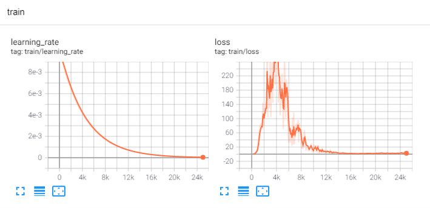
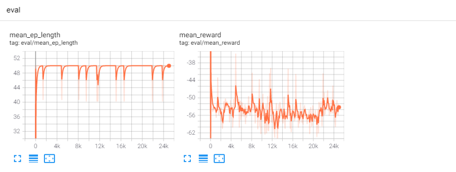
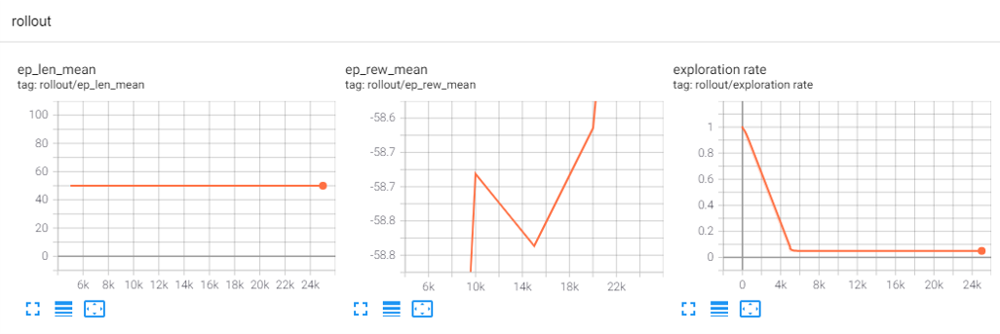

#dqn_train Issue Record
- - -
## IR #1
Sat Jan  8 19:14:38 2022
<details>
<summary> <strong>Code</strong></summary>

```python
from stable_baselines3 import DQN
from stable_baselines3.dqn.policies import MlpPolicy
from stable_baselines3.common.env_checker import check_env
from stable_baselines3.common.evaluation import evaluate_policy

from Sample.Cube.Env.cube_env import CubeEnv
from Sample.Cube.DQN.cube_feature_extractor import CubeFeatureExtractor

env = CubeEnv(3)
check_env(env)
policy_kwargs = {'features_extractor_class': CubeFeatureExtractor,
                 'features_extractor_kwargs':
                     {'features_dim': 32 * 6}
                 }
model = DQN(MlpPolicy, env, verbose=1, policy_kwargs={'features_extractor_class': CubeFeatureExtractor})

# mean_reward, std_reward = evaluate_policy(model, env, n_eval_episodes=1)
# print(f"mean_reward:{mean_reward:.2f} +/- {std_reward:.2f}")

model.learn(10)
```

</details>

###Issue name
Training 성능의 저조
###Issue description
1. QNetwork의 구조 문제(`net_arch`)인 경우
2. FeaturesExtractor의 구조 문제인 경우
3. observation_space의 문제인 경우
###Solution
1. QNetwork의 구조를 바꿔본다.
2. FeaturesExtractor의 구조를 바꾼다.
3. observation_space를 `MultiDiscrete`에서 `Box`로 바꾼다.
    - Note: 
      `Multidiscrete` obs가 `utils.preprocess_obs()`로부터 one-hot encoding이 되는 것으로 보아, 
       Multi-observation 에 적합한 space일 것이라고 추측.  
       따라서 multi-value를 자연스럽게 지원하는 Box를 int type으로 사용해볼 수 있을 것.
    
### Note
[stable_baselines3.md](Sample/Cube/baselines3.md)를 통해 learning process, parameter 참고.- - -

- - -
## IR #2
Fri Jan 14 10:27:29 2022
<details>
<summary> <strong>Code</strong> </summary>

```python
from stable_baselines3 import DQN
from stable_baselines3.dqn.policies import MlpPolicy
from stable_baselines3.common.env_checker import check_env

from Sample.Cube.Env.cube_env import CubeEnv
from Sample.Cube.DQN.cube_feature_extractor import CubeFeatureExtractor

env = CubeEnv(3)
check_env(env)

dqn_kwargs = {'policy': MlpPolicy,
              'env': env,
              'learning_rate': 1e-4,
              'buffer_size': 1e6,
              'learning_starts': 5e4,
              'batch_size': 32,
              'tau': 1.0,
              'gamma': 0.99,
              'train_freq': 4,
              'gradient_steps': 1,
              'replay_buffer_class': None,
              'replay_buffer_kwargs': None,
              'optimize_memory_usage': False,
              'target_update_interval': 1e4,
              'exploration_fraction': 0.1,
              'exploration_initial_eps': 1.0,
              'exploration_final_eps': 0.01,
              'max_grad_norm': 10.0,
              'tensorboard_log': None,
              'create_eval_env': False,
              'policy_kwargs': None,
              'verbose': 0,
              'seed': None,
              'device': 'auto',
              '_init_setup_model': True}

policy_kwargs = {
    'features_extractor_class': CubeFeatureExtractor,
    'features_extractor_kwargs': {'features_dim': 32 * 6},
    'net_arch': [256, 256, 192, 64],
}

import torch.optim as optim

dqn_kwargs['tau'] = 0.99
dqn_kwargs['gradient_steps'] = -1
dqn_kwargs['verbose'] = 1
dqn_kwargs['learning_rate'] = optim.lr_scheduler.LambdaLR()  # ????

model = DQN(MlpPolicy, env, verbose=1, policy_kwargs={'features_extractor_class': policy_kwargs})
model.learn(10)

```

</details>

###Issue name
stable_baselines3 training에서 lr_scheduler를 설정하는 문제
###Issue description
- DQN Model에 lr을 따로 넘기고, DQNPolicy에 optimizer_class를 따로 넘긴다.
- lr은 인스턴스로 넘겨야 하고, optimizer는 class type으로 넘겨야 해서 lr_scheduler 인스턴스 초기화에 필요한 optimizer를 지정할 수 없다.  
    `optim.lr_scheduler.StepLR(optimizer=optimizer, ...)`
###Solution
- model kwargs parameter로 `learning_rate`를 적절한 function으로 넘겨주면 된다.  
  -> `learning_rate`가 `_current_progress_remaining` (전체 traning 중에서 현재) 

### Note
**Model Learning Process**
  - `DQN.learn() -> ... DQN.train() -> BaseAlgorithm._update_learning_rate() -> utils.update_learning_rate()`
  
  
<details>
<summary>
  <code>DQN.train()</code>
</summary>

```python
def train(self, gradient_steps: int, batch_size: int = 100) -> None:
    self.policy.set_training_mode(True)
    self._update_learning_rate(self.policy.optimizer) # <- !!!
    ...
```
</details>

<details>
<summary>
  <code>BaseAlgorithm._update_learning_rate()</code>
</summary>

```python
from stable_baselines3.common.base_class import *

def _update_learning_rate(self, optimizers: Union[List[th.optim.Optimizer], th.optim.Optimizer]) -> None:
    """
    Update the optimizers learning rate using the current learning rate schedule
    and the current progress remaining (from 1 to 0).
    :param optimizers:
        An optimizer or a list of optimizers.
    """
    # Log 기록
    self.logger.record("train/learning_rate", self.lr_schedule(self._current_progress_remaining))
    
    if not isinstance(optimizers, list):    # optimizers가 list가 아니면 list로 만듦
        optimizers = [optimizers]
    for optimizer in optimizers:    # optimizers:list 에 있는 모든 optimizer에 대해 lr update
        update_learning_rate(optimizer, self.lr_schedule(self._current_progress_remaining))
```
</details>

<details>
<summary>
  <code>utils.update_learning_rate()</code>
</summary>

```python
import torch as th

def update_learning_rate(optimizer: th.optim.Optimizer, learning_rate: float) -> None:

    # optimizer의 모든 parameters 에 대해 lr을 learning_rate로 세팅
    for param_group in optimizer.param_groups:  
        param_group["lr"] = learning_rate
```
</details>

- - -
## IR #3
Mon Jan 17 01:35:20 2022
<details>
<summary>
  <strong>Code</strong>
</summary>

```python
import yaml

config = yaml.full_load(open('args/dqn_config_default.yaml'))

model_kwargs = config['model']
policy_kwargs = config['policy']
learning_kwargs = config['learning']

from stable_baselines3.dqn.policies import FlattenExtractor
from Sample.Cube.Env.cube_env import *
from time import ctime

policy_kwargs1 = policy_kwargs.copy()
model_kwargs1 = model_kwargs.copy()
learning_kwargs1 = learning_kwargs.copy()
env = CubeEnv(3)

policy_kwargs1['features_extractor_class'] = FlattenExtractor

model_kwargs1['learning_rate'] = lambda x: 0.01 * (0.5 **(8*(1-x)))
model_kwargs1['buffer_size'] = 1000
model_kwargs1['learning_starts'] = 100
model_kwargs1['batch_size'] = 16
model_kwargs1['tau'] = 0.99
model_kwargs1['train_freq'] = 1
model_kwargs1['gradient_steps'] = model_kwargs['train_freq']
model_kwargs1['target_update_interval'] = 10
model_kwargs1['exploration_fraction'] = 0.2
model_kwargs1['tensorboard_log'] = 'logs/tb_log/' + ctime().replace(' ', '-')
model_kwargs1['policy_kwargs'] = policy_kwargs1
model_kwargs1['verbose'] = 1

learning_kwargs1['log_interval'] = 100
learning_kwargs1['eval_env'] = env
learning_kwargs1['eval_freq'] = 100
learning_kwargs1['n_eval_episodes'] = 5
learning_kwargs1['eval_log_path'] = 'logs/eval_log/'

from stable_baselines3.dqn import DQN
from stable_baselines3.dqn.policies import MlpPolicy

model = DQN(policy=MlpPolicy, env=env, **model_kwargs1)
model.learn(total_timesteps=25000, **learning_kwargs1)
```

</details>

###Issue name
Training_set_1 training result
###Issue description
**Train result**
- train result<br>
    
    loss가 training이 진행되며 충분히 수렴한 것 처럼 보인다.
- evaluate result<br>
    
    그러나 evaluation(5 episodes)의 평균 reward와 평균 episode length는 개선이 거의 없다.<br>
    episode length는 problem solving의 효율성, reward는 적합성을 나타내므로 학습 효과를 기대하기 어렵다.
- rollout result<br>
    
    rollout: dqn에서 replay_buffer에 넣기 위해 policy로부터 action을 선택하는 것. <br>
    rollout을 하며 진행된 episode의 length는 변화가 없었으며, epsilon은 잘 줄었지만, 
    rollout 과정에서 episode reward는 앞뒤로 데이터가 나오지 않은 것이 이상함. 

결론적으로 loss가 수렴하였으므로 target-Q_value 학습은 잘 되는 것으로 볼 수 있으나<br>
1. **env의 복잡성** <br>
    극히 일부의 action sequence만이 높은 reward를 내기 때문에 policy가 optimal action을 찾지 못하는 문제<br>
    - 근거<br>
        mean_env_length를 보면, 거의 대부분이 max step인 50임을 알 수 있으며 따라서 reward high를 얻지 못하고
        episode가 종료되는 경우가 대부분이었을 것. 따라서 optimal 로 가기 위해서는 reward high의 path까지 gradient가 지속적으로 들어와야 하는데 
        그럴 기회 자체가 적은 문제.
   

2. **exploration rate의 과도**<br>
    training의 parameter로써, exploration_fraction이 너무 커서(=epsilon scheduling이 잘 안돼서)
    optimial action을 찾지 못하는 문제

###Solution
다른 training configuration 사용